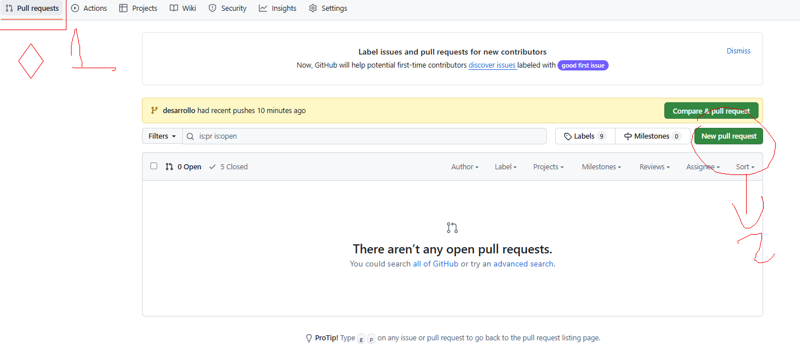

# ProyectoFinalModulo2

Grupo 1 - Capitulo final (Bad Ending)

Integrantes:
    -Jorge Riffo
    -Marjory Recabal
    -Elvis  
    -Paula Bahamondes
    -Daniel Mandiola

Pasos a seguir para desarrollar

1. Actualizar cambios en rama desarrollo
2. En nuestra rama hacer 'git merge desarrollo' en el terminal
3. Trabajar en el desarrollo
4. Al terminar hacer commit 
5. Pull Request (Git hub Navegador)
    